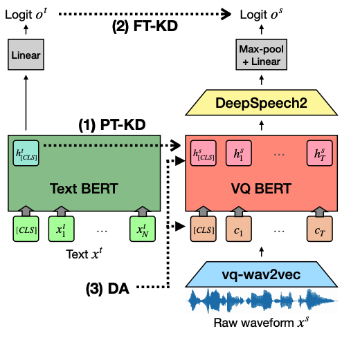
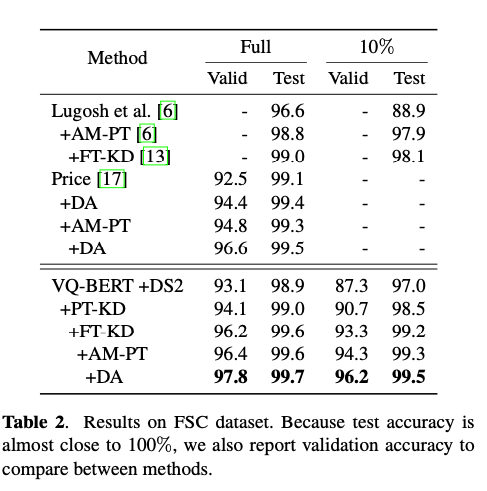
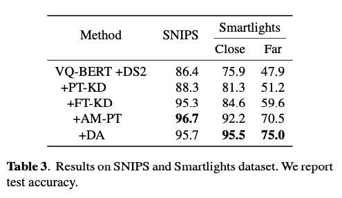

# Two-Stage Textual Knowledge Distillation for End-to-End Spoken Language Understanding (ICASSP 2021)
Official Python3 implementation of the ICASSP 2021 paper (https://arxiv.org/abs/2010.13105) proposing two-stage textual knowledge distillation method for end-to-end spoken language understanding.

Authors: [Seongbin Kim](mailto:zelabean@naver.com), [Gyuwan Kim](mailto:gyuwan.kim@navercorp.com), [Seongjin Shin](mailto:sungjin7127@gmail.com), [Sangmin Lee](mailto:sanglee@inha.ac.kr)

### Overview and Main Results
Our E2E SLU model is a combination of vq-wav2vec BERT and DeepSpeech2 acoustic model.
We perform knowledge distillation from the text BERT model to the speech encoder during (1) additional pre-training (PT-KD) and (2) fine-tuning (FT-KD).
Also, we use (3) data augmentation methods (DA) in fine-tuning.
<table border="0" cellspacing="0" cellpadding="0">
  <tr>
    <td><p align="center"></p></td>
    <td><p align="center">
        
        
    </p></td>
  </tr>
</table>
</p>


## Pre-trained Model
Description | Dataset | Model
---|---|---
vq-wav2vec K-means <br> [vq-wav2vec: Self-Supervised Learning of Discrete Speech Representations (Baevski et al., 2019)](https://arxiv.org/abs/1910.05453) | [Librispeech](http://www.openslr.org/12) | [download](https://dl.fbaipublicfiles.com/fairseq/wav2vec/vq-wav2vec_kmeans.pt)
RoBERTa on K-means codes <br> [vq-wav2vec: Self-Supervised Learning of Discrete Speech Representations (Baevski et al., 2019)](https://arxiv.org/abs/1910.05453) | [Librispeech](http://www.openslr.org/12) | [download](https://dl.fbaipublicfiles.com/fairseq/wav2vec/bert_kmeans.tar)
RoBERTa-base on Text <br> [RoBERTa: A Robustly Optimized BERT Pretraining Approach (Yinhan et al., 2019)](https://arxiv.org/abs/1907.11692)| - | [download](https://dl.fbaipublicfiles.com/fairseq/models/roberta.base.tar.gz)
Knowledge Distillation Pretrained Model| [Librispeech](http://www.openslr.org/12) | [download](https://drive.google.com/file/d/17LaC0goU1xNEsQ5DHJkGOh1efBSmos9J/view?usp=sharing)
Finetuned Text RoBERTa Model| [Fluent Command Speech Dataset, need auth](https://groups.google.com/a/fluent.ai/forum/#!forum/fluent-speech-commands) | [download](https://drive.google.com/file/d/1RKyBVuDpyCNmmeZR9yjw77uQh2uQlPeE/view?usp=sharing)
Acoustic Model Pretrained Model | [Librispeech](http://www.openslr.org/12) | [download](https://drive.google.com/file/d/1QKDiILOnKcWx8-lfryOIMumZIo_eiMba/view?usp=sharing)
Two-stage Textual Knowledge Distillation SLU Model <br> (P-KD + F-KD + AM Pretrain + Data Augmentation) | [Fluent Command Speech Dataset, need auth](https://groups.google.com/a/fluent.ai/forum/#!forum/fluent-speech-commands) | [download](https://drive.google.com/file/d/1QUzHJSWZfvBXF6UqFNi0EHZHwZ6KrEN9/view?usp=sharing)


## Getting Started

### Requirements
```python3
Python 3.7.4
ctcdecode==0.4
torch==1.4.0
fairseq==0.9.0 (git history 3335de5f441ee1b3824e16dcd98db620e40beaba)
torchaudio==0.5.0
warpctc-pytorch==0.1
soundfile
```
Install with pip is very tricky because of the dependency between libraries so we recommend using our docker file by running `docker run bekinsmingo/icassp:v4`.

### Data Preparation
Download datasets and run the following script to convert wav files to vq tokens and manifest.
```shell script
python preprocessing.py --config ./configs/preprocessing.json
```


## Training

### Text Fine-tuning
```shell script
python text_finetuning.py --config ./configs/text_fine.json \
    --train-manifest ./manifest/vq_fsc_train.csv \
    --val-manifest ./manifest/vq_fsc_valid.csv
```

### AM Pre-training
```shell script
python am_pretraining.py --train-manifest manifest/am_pretrain_manifest.csv \
    --val-manifest manifest/am_pretrain_manifest.csv \
    --config configs/am_pre.json
```

### Fine-tuning Knowledge Distillation
```shell script
python finetuning.py --config ./configs/finetuning_kd.json \
    --train-manifest ./manifest/vq_fsc_train.csv \
    --val-manifest ./manifest/vq_fsc_valid.csv \
    --infer-manifest ./manifest/vq_fsc_test.csv \
    --prekd-path xbt_recent \
    --ampre-path xbt_asr.pth \
    --intent-path ./manifest/intent_dict
```

## Third-party Implementations
- [fairseq](https://github.com/pytorch/fairseq/tree/master/examples/wav2vec)
- [SeanNaren/Deepspeech2](https://github.com/SeanNaren/deepspeech.pytorch)


## Citation
```
@article{kim2020two,
  title={Two-Stage Textual Knowledge Distillation for End-to-End Spoken Language Understanding},
  author={Kim, Seongbin and Kim, Gyuwan and Shin, Seongjin and Lee, Sangmin},
  journal={arXiv preprint arXiv:2010.13105},
  year={2020}
}
```

## License
```
Copyright (c) 2021-present NAVER Corp.

Licensed under the Apache License, Version 2.0 (the "License");
you may not use this file except in compliance with the License.
You may obtain a copy of the License at

    http://www.apache.org/licenses/LICENSE-2.0

Unless required by applicable law or agreed to in writing, software
distributed under the License is distributed on an "AS IS" BASIS,
WITHOUT WARRANTIES OR CONDITIONS OF ANY KIND, either express or implied.
See the License for the specific language governing permissions and
limitations under the License.
```
